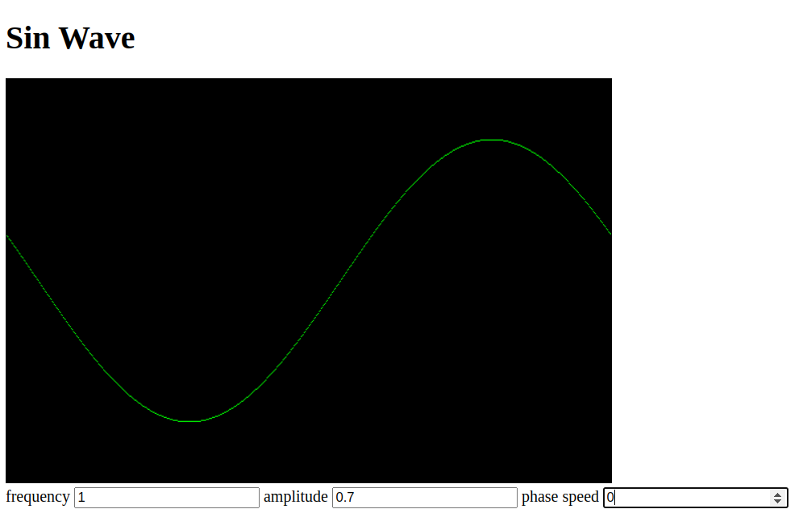

# hello wasm
A simple project made to learn the basics of web assembly.
It fills a matrix as a sine wave and draws that matrix into the js canvas.

serve files:
```bash
cd src
python3 -m http.server 8080
```
